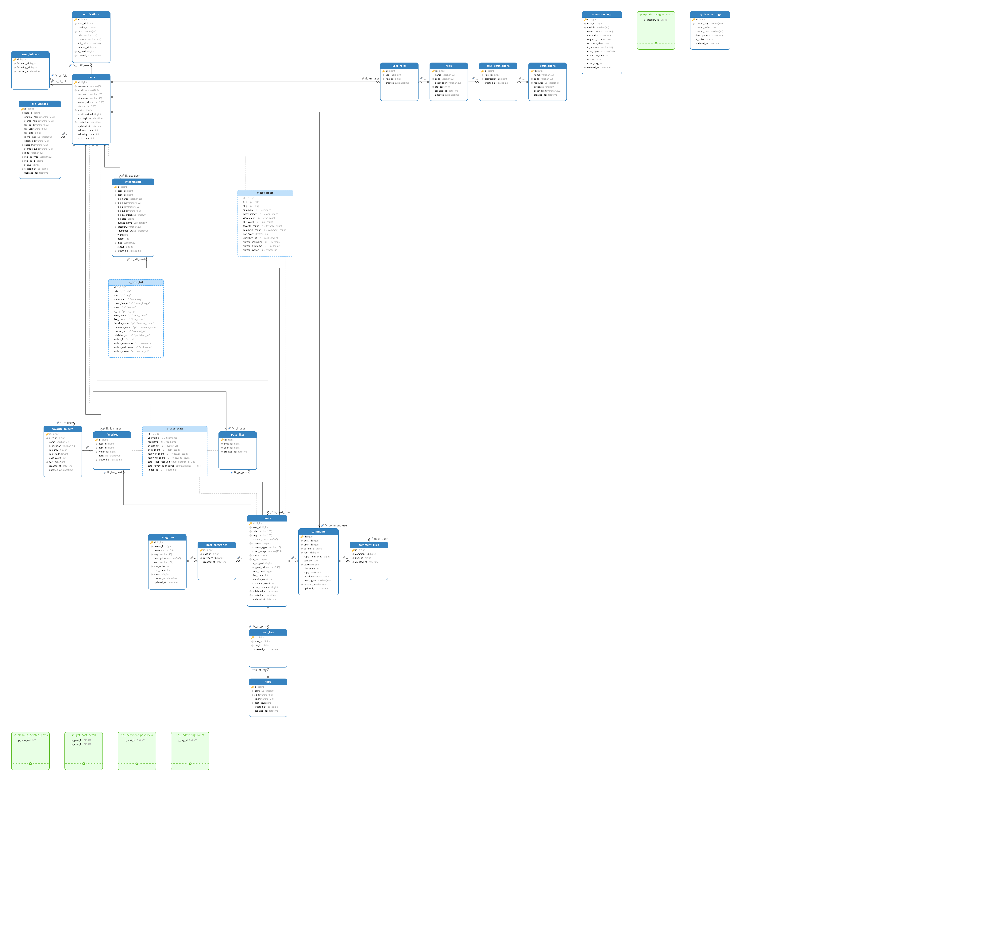

# Blog System - Modern Blog Platform

> 基于 Spring Boot 3.x + Redis + RabbitMQ + MinIO 构建的现代化博客系统

[](https://spring.io/projects/spring-boot) [](https://www.oracle.com/java/) [](https://redis.io/) [](https://www.rabbitmq.com/)

## 📝 License

GPL-3.0 License

## ✨ 核心亮点

### :rocket: 高性能架构

- **Redis 缓存** - 点赞/收藏数据缓存预热机制，单次查询走 Redis，批量查询触发 DB 预热
- **RabbitMQ 异步解耦** - 点赞、收藏、通知等高频操作异步处理,先更新 Redis 缓存保证响应速度，再通过 MQ 异步落库，实现最终一致性
- **定时同步任务** - 每 5 分钟将 Redis 计数批量同步到 MySQL，保证数据最终一致性

### :floppy_disk: 分布式存储

- **MinIO 对象存储** - 支持图片、文档上传，MD5 去重实现"秒传"
- **文件分类管理** - 自动识别文件类型（图片/文档/视频），按日期分层存储

### :envelope: 通知系统

- **MQ 驱动通知** - 评论、回复、点赞、收藏、关注等 6 种通知类型
- **Redis 计数缓存** - 未读数量实时更新，按类型统计，1 小时过期

### :speech_balloon: 评论系统

- **树形评论结构** - 支持多级嵌套回复，root_id 快速定位根评论
- **点赞防重复** - Redis + DB 双查机制，避免数据不一致

### :star: 点赞/收藏

- **幂等性保证** - MQ 消息防重，DuplicateKeyException 捕获
- **批量预热机制** - 首次批量查询触发缓存预热，标记已初始化，后续查询直接走 Redis


## 📦 技术栈

| 技术                  | 版本  | 说明        |
| --------------------- | ----- | ----------- |
| Spring Boot           | 3.2.0 | 核心框架    |
| MyBatis-Plus          | 3.5.9 | ORM 框架    |
| Redis                 | 7.x   | 缓存 + 计数 |
| RabbitMQ              | 3.x   | 消息队列    |
| MinIO                 | -     | 对象存储    |
| MySQL                 | 8.x   | 数据库      |
| Spring Security + JWT | -     | 认证授权    |
| Knife4j               | 4.x   | API 文档    |

## :classical_building: 系统架构

### :building_construction: 系统架构图​

```
┌─────────────┐    ┌─────────────┐    ┌─────────────┐
│   客户端     │───▶│  Spring Boot │───▶│   MySQL     │
└─────────────┘    │   应用层     │    └─────────────┘
                   └──────┬──────┘
                          │
              ┌───────────┼───────────┐
              ▼           ▼           ▼
        ┌─────────┐ ┌─────────┐ ┌─────────┐
        │  Redis  │ │RabbitMQ │ │ MinIO   │
        │  缓存层  │ │ 消息队列 │ │对象存储 │
        └─────────┘ └─────────┘ └─────────┘
```


### :date:数据库设计



## 🔥 核心功能

### 1. 用户系统

- 注册/登录（JWT 认证）
- 个人资料管理
- 权限控制（RBAC）

### 2. 文章管理

- 文章 CRUD（草稿/发布）
- Markdown 支持
- 分类/标签管理
- 文章浏览量统计

### 3. 互动功能

- **点赞** - Redis 缓存 + MQ 异步入库
- **收藏** - 收藏夹管理，批量移动
- **评论** - 多级嵌套，点赞支持
- **通知** - 实时推送（评论/回复/点赞/收藏/关注）

### 4. 文件上传

- 支持图片/文档上传
- MD5 去重秒传
- 文件分类管理
- 用户存储空间统计

## 📊 性能优化

### Redis 缓存策略

```java
// 点赞数据缓存
KEY: user:{userId}:liked:posts -> Set<postId>
KEY: post:{postId}:like_count -> Integer

// 缓存预热标记
KEY: like:cache:init:user:{userId}:POST -> "1" (TTL: 7天)
```

### MQ 消息队列

```java
// 点赞消息
Exchange: blog.like.exchange
Queue: blog.like.post.queue
RoutingKey: like.post

// 通知消息
Exchange: blog.notification.exchange
Queue: blog.notification.queue
RoutingKey: notification.*
```

### 定时任务

- **Redis → DB 同步** - 每 5 分钟同步点赞/收藏计数
- **缓存清理** - 每天凌晨 3 点清理过期缓存

## 🚀 快速开始

### 环境要求

- JDK 17+
- MySQL 8.0+
- Redis 7.x
- RabbitMQ 3.x
- MinIO（可选）

### 配置文件

```yaml
# application.yml
spring:
  datasource:
    url: jdbc:mysql://localhost:3306/blog_system
    username: root
    password: your_password
    
  data:
    redis:
      host: localhost
      port: 6379
      
  rabbitmq:
    host: localhost
    port: 5672
    username: guest
    password: guest

minio:
  endpoint: http://localhost:9000
  access-key: minioadmin
  secret-key: minioadmin
```

### 启动步骤

```bash
# 1. 启动 MySQL/Redis/RabbitMQ
docker-compose up -d

# 2. 导入数据库
mysql -u root -p < blog_system.sql

# 3. 启动应用
mvn spring-boot:run

# 4. 访问 API 文档
http://localhost:8080/api/doc.html
```

### 🏛️ 政务风格前端

前端为纯静态页面，由 Spring Boot 直接托管，无需额外启动 Node 服务：

```text
src/main/resources/static/
├── index.html        # 首页：轮播图 + 通知公告 + 分栏目 + 热点关注
├── category.html     # 栏目列表页
└── post.html         # 文章详情页（Markdown 渲染）
```

启动后端后访问 `http://localhost:8080/api/` 即可。
后端未启动时，URL 加 `?demo=1`（如 `index.html?demo=1`）可使用内置演示数据预览。
详细说明见 [docs/frontend.md](docs/frontend.md)。

首次使用建议依次导入：

```bash
mysql -u root -p blog_system < Sql/government_phase2_categories.sql
mysql -u root -p blog_system < Sql/government_phase3_hot_posts.sql
mysql -u root -p blog_system < Sql/government_phase5_admin_permissions.sql
mysql -u root -p blog_system < Sql/government_frontend_seed_posts.sql
```

## 📖 API 文档

启动后访问 Knife4j 文档：`http://localhost:8080/api/doc.html`

核心接口：

- `/auth/**` - 认证授权
- `/posts/**` - 文章管理
- `/comments/**` - 评论管理
- `/likes/**` - 点赞功能
- `/favorites/**` - 收藏功能
- `/notifications/**` - 通知系统
- `/files/**` - 文件上传

## 🎯 设计亮点

### 1. 缓存预热机制

```java
// 首次批量查询触发预热
Map<Long, Boolean> batchCheckPostLikes(List<Long> postIds, Long userId) {
    if (!isCacheWarmed(userId, "POST")) {
        // 一次性加载所有点赞记录
        List<Long> allLikedPostIds = postLikeMapper.selectLikedPostIdsByUser(...);
        // 批量写入 Redis
        redisTemplate.opsForSet().add(userLikeKey, allLikedPostIds.toArray());
        // 标记已预热
        markCacheWarmed(userId, "POST");
    }
}
```

### 2. MQ 消费幂等性

```java
try {
    postLikeMapper.insert(postLike);
} catch (DuplicateKeyException e) {
    // 重复点赞，忽略（幂等性保证）
    log.warn("重复点赞记录: userId={}, postId={}", userId, postId);
}
```

### 3. 通知防重复

```java
// 1 小时内相同通知不重复发送
if (notificationMapper.existsSimilarNotification(recipientId, senderId, type, relatedId)) {
    log.info("跳过重复通知");
    return;
}
```

## 👤 Author

**GALA_Lin**

- GitHub: [@GALA-Lin](https://github.com/GALA-Lin)
- Email: gala_lin@outlook.com

------

⭐ 如果这个项目对你有帮助，欢迎 Star！
